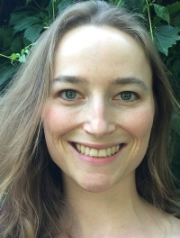
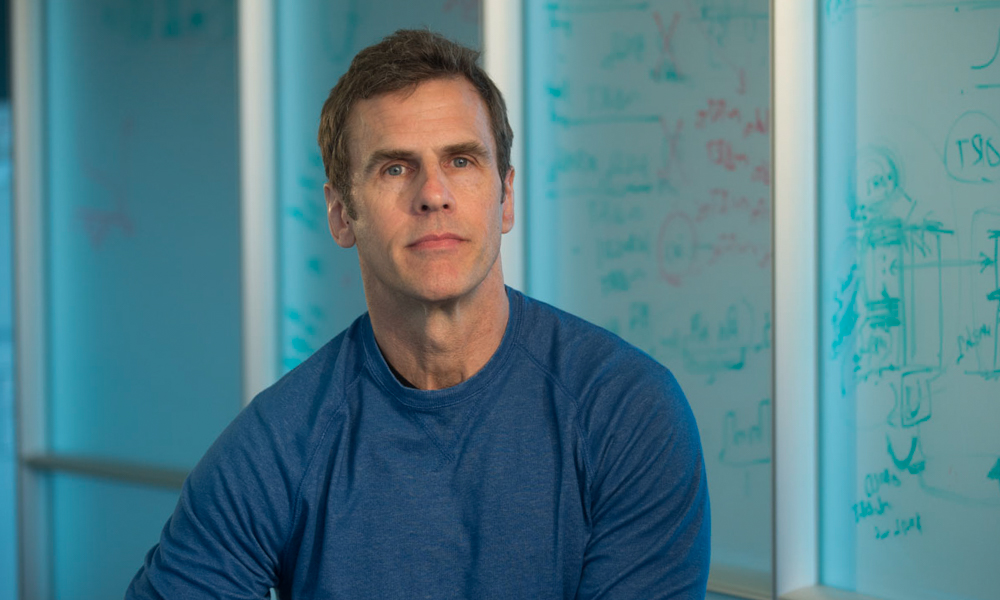
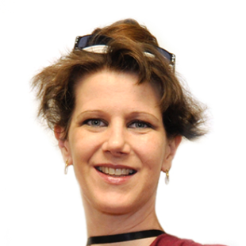

There will be a Computational preconference at this year's <a href = "https://www.socialaffectiveneuro.org/conferences.html">SANS</a> meeting in Miami, FL.

The goal of this workshop is to provide a general introduction to applying computational approaches to social and affective neuroscience questions. Each speaker will provide an introduction to a specific technique (e.g., drift diffusion modeling, multivariate prediction and representational similarity analysis, functional alignment, and social networks) and illustrate how these techniques can be can be used to make inferences about various computational and affective processes. In addition we will have group discussions about "Barriers to Training" and "What is a Model?"

<section>
<h2>Speakers</h2>

  

  <h3><a href="http://cosanlab.com/">Luke <strong>Chang</strong></a></h3>
  <h4>Dartmouth College</h4>
  Dr. Luke Chang, PhD is an Assistant Professor of Psychological and Brain Sciences at Dartmouth College and directs the Computational Social Affective Neuroscience Laboratory. He completed a BA in psychology at Reed College, an MA in psychology at the New School for Social Research, and a PhD in clinical psychology and cognitive neuroscience at the University of Arizona. In addition, Luke completed his predoctoral clinical internship training in behavioral medicine at the University of California Los Angeles and a postdoctoral fellowship at the University of Colorado Boulder in multivariate neuroimaging techniques. His research program is focused on understanding the neurobiological and computational mechanisms underlying emotions and social interactions and his research spans the emerging fields of social, affective, and decision neurosciences. 

  
  
  <h3><a href="https://csnl.uoregon.edu/">Rob <strong>Chavez</strong></a></h3>
  <h4>University of Oregon</h4>

  
<h3><a href="https://www.decisionneurolab.com/">Cendri <strong>Hutcherson</strong></a></h3>
<h4>University of Toronto</h4>

  
<h3><a href="http://labs.vtc.vt.edu/cpu/">Read <strong>Montague</strong></a></h3>
<h4>Virginia Tech/UCL</h4>

  
<h3><a href="http://csnlab.org/">Carolyn <strong>Parkinson</strong></a></h3>
<h4>University of California Los Angeles</h4>

  
<h3><a href="http://www.ccs.fau.edu/~tognoli/">Emmanuelle <strong>Tognoli</strong></a></h3>
<h4>Florida Atlantic University</h4>

</section>

This meeting is generously supported by Google and the Army Research Office.
